# Springboot - Đăng Quang Watch clone
### Technologies:
- HTML/CSS/JS.
- Springboot v3.3.2.
  - Spring JPA.
  - Spring Web.
  - Spring Mail.
  - Spring Security & OAuth2.
  - Lombok.
  - Thymeleaf.
  - Validation.
  - WebSocket.
- [Live reload with Tailwindcss](https://www.wimdeblauwe.com/blog/2022/08/27/thymeleaf-live-reload-with-spring-boot-and-tailwind-css/).
- [Cloudinary](https://console.cloudinary.com/).
- [VNPay Sandbox](https://sandbox.vnpayment.vn/apis/docs/thanh-toan-pay/pay.html).

### Database:
- Server type: MariaDB.
- Server version: 10.4.22-MariaDB - mariadb.org.
- Server charset: UTF-8 Unicode (utf8mb4).
- SQL file: `database.sql`

### Features:
- Fully responsive with Tailwindcss.
- User interface:
  - Login & Regsiter.
  - Login with Google.
  - View products.
  - Search products.
  - Place order.
  - Track order.
- Admin panel:
  - Crud operations.
    - Products.
    - Accounts.
    - Orders.
  - Orders tracking.
  - Track orders.
  - Analytics.
  - Import & export tracking.
- Database triggers & procedures.

### Prequesition:
- Nodejs installed.
- Have suitable JDK version.
- Have Maven installed.
- Have a [Cloudinary](https://console.cloudinary.com/) developer account.
- Have a [VNPay Merchant](https://sandbox.vnpayment.vn/devreg/) account.
- Have an SMPT service.
- Have Google and Github auth credentials setup (if you want to login with Google & Github).
- **(optional)** Have docker installed to run mail-dev
- Config Spring **application.properties**. All configurations are inside: `main/resources/application-properties.txt`
- Setup MySQL/MariaDB database from `database.sql`.

### Run & Build:
1. Start the Spring Boot application with the local profile. `mvn spring-boot:run`.
2. Run `npm run build && npm run watch` from the command line.
3. As a final change to the pom.xml, we can add a profile that calls our production NPM scripts. At release time, be sure to enable this Maven profile. `mvn spring-boot:run -P release`.

### Notes:
- Product page is not very polished.
- No product ratings.
- No phone number verification.
- UI design is not modern.

### Screenshots:
#### Auth ui:
- Login page:
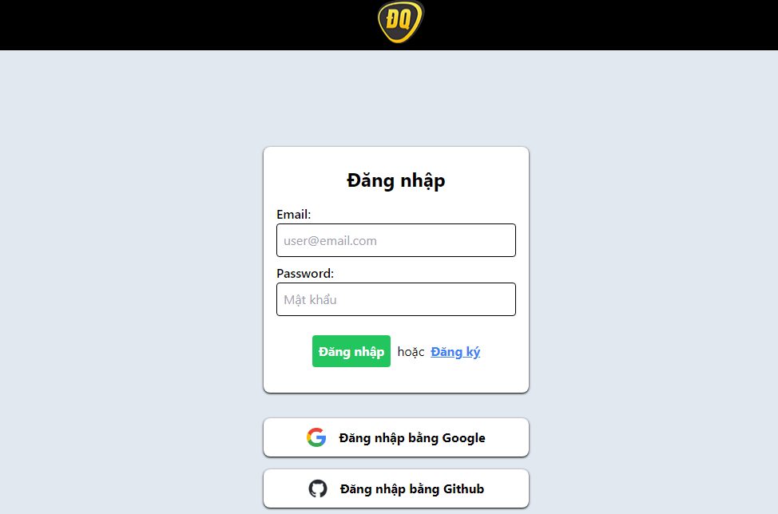
- Register page:
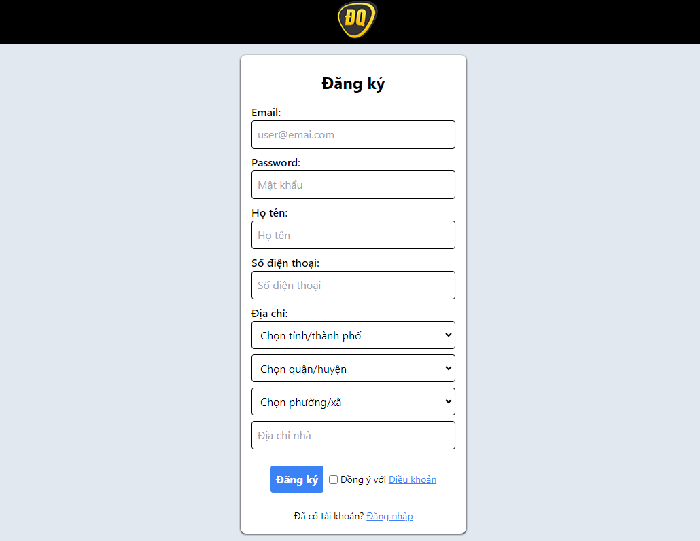
#### User ui:
- Landing page:
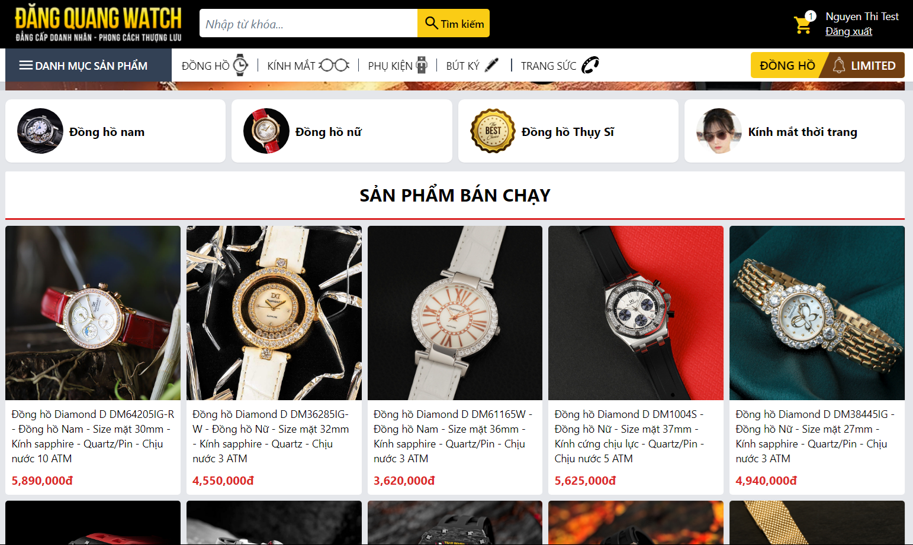
- Product page:
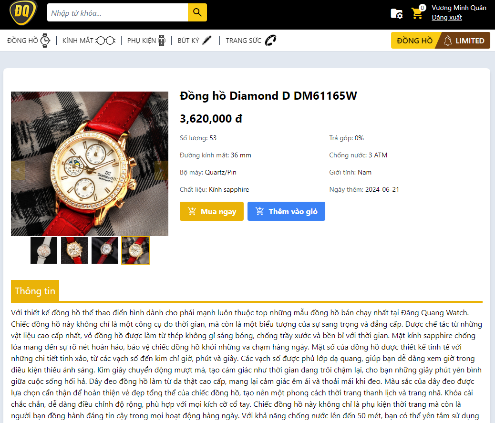
- Cart:
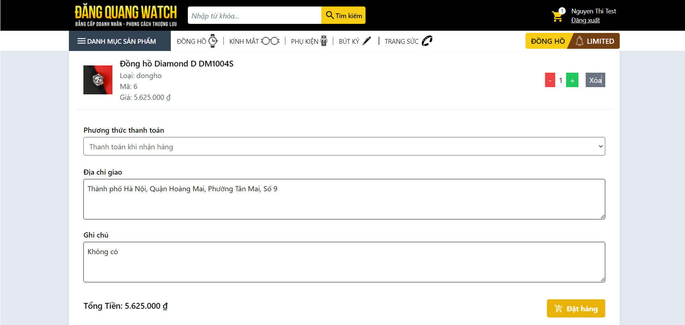
- Track your orders:
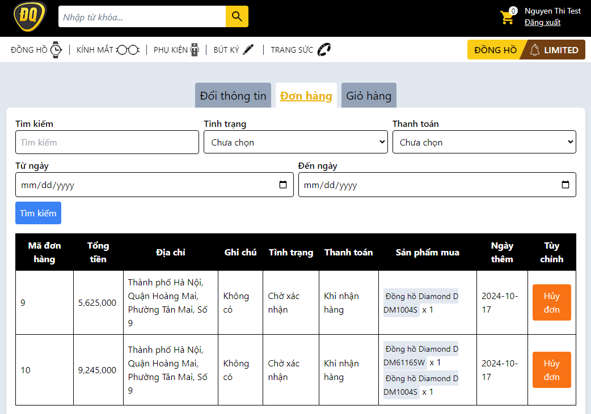
- Profile:
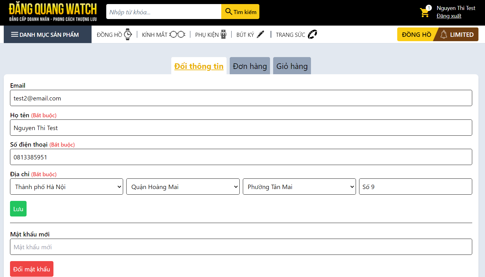
### Admin ui:
- Analytics:
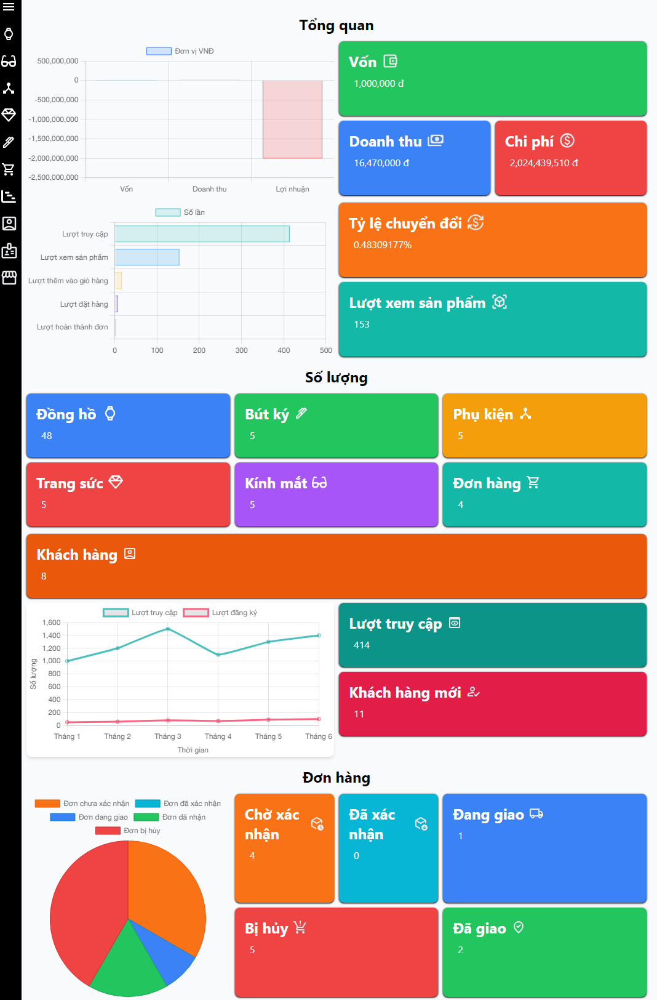
- Manage product (watches):
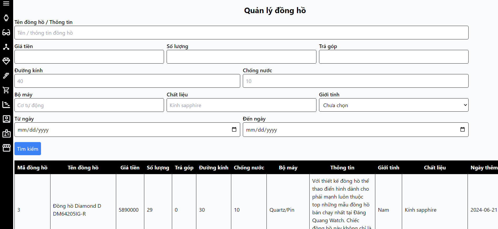
#### Emails:
- Email confimation:
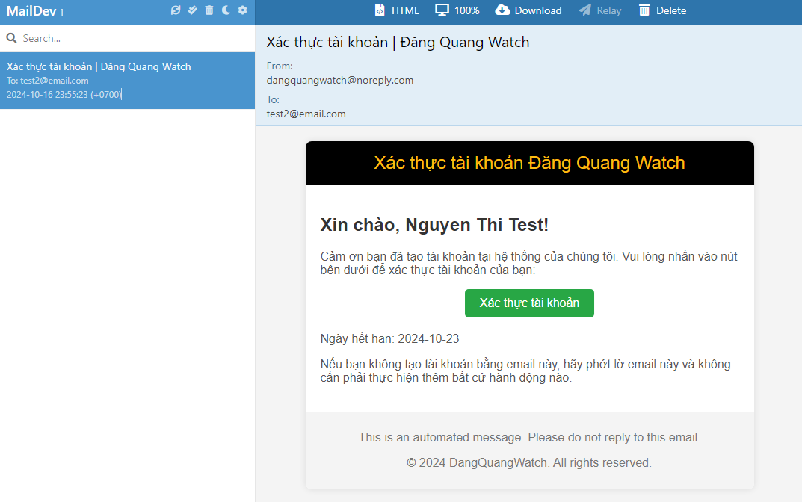
- Order successful email:
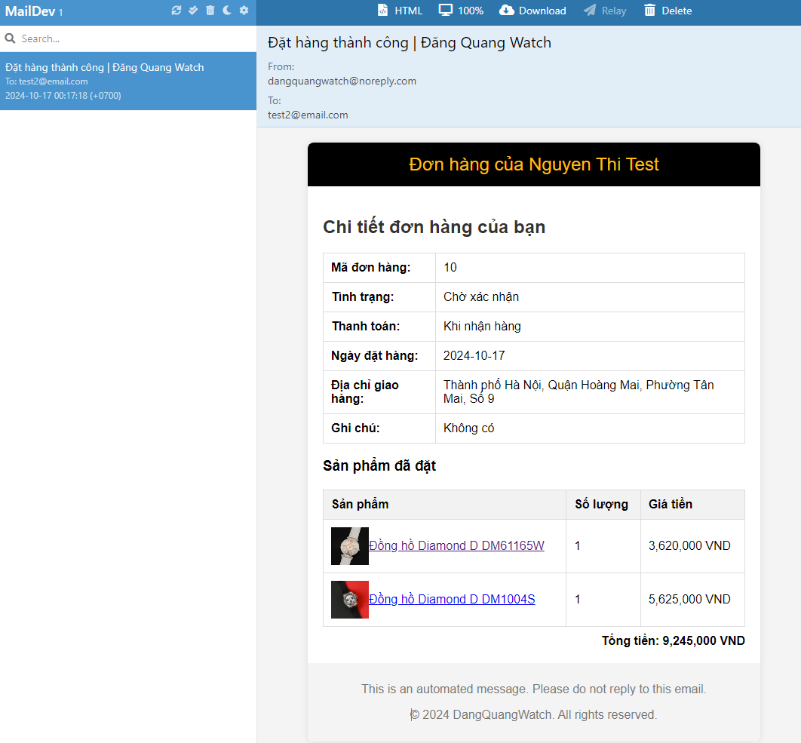

### Containerize with docker:
1. Build target: `mvn clean package`
2. Build static files: `npm run build`
3. Containerize: `docker-compose up --build`
4. Access the application: `http://localhost:8080`